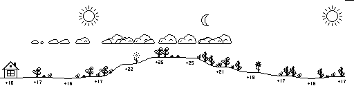

# Minimalistic copy of `lds133`'s Weather Landscape

<p align="center">

</p>

Visualizing Weather Forecasts Through Landscape Imagery 

Forked from [lds133](https://github.com/lds133) excellent project.

Visit [https://openweathermap.org/](https://openweathermap.org/) for an API Key
and export it as `OWM_KEY=...` in your environment

Installable via pip:
```bash
$ pip install .
$ # OR
$ pip install git+https://github.com/rdyro/weather_landscape
```

Example usage
```python
from weather_landscape import WeatherLandscape

# lon - longitude, lat - latitude as floating point numbers (negative for west and south)
w = WeatherLandscape(lon=52.237049, lat=21.017532, width=1024, height=128)
img = w.make_img() # get the PIL.Image.Image object directly

# or render and save to file
filename = "warsaw_weather_landscape.png"
w.make_and_save_img(filename) # make and save the image
```

### Dynamically Serving the Weather Landscape

Run the [Flask](https://github.com/pallets/flask) server
```bash
$ env OMW_KEY={your key} python3 server.py
```

Visit the URL 
- `http://{server address}/image?lat={latitude}&lon={longitude}&width={width}&height={height}&temperature_unit={unit}`

for example

- `http://localhost:8000/image?lat=52.24&lon=21.02&width=512&height=128&temperature_unit=C`


### Legend

| Event image | Description |
|----------|------------|
|| Sunrise | 
|| Sunset |
|| Cloud cover |
|| Current time position|
|| Midnight |
|| Midday |
|| South wind |
|| East wind |
|| West wind |
|| North wind |
